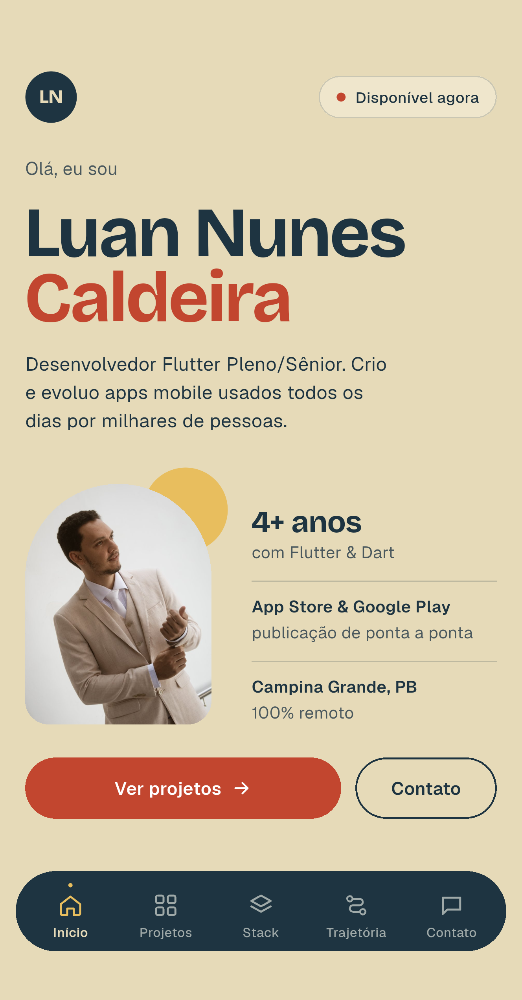
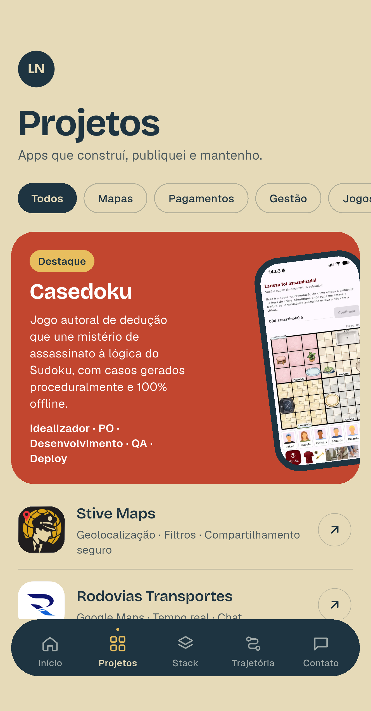
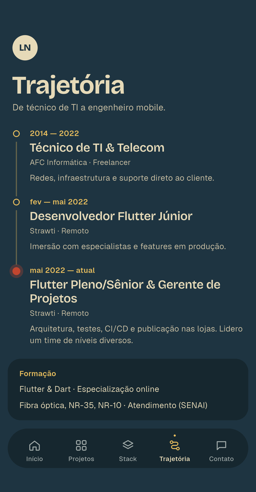

# Portfólio — Luan Nunes

Portfólio pessoal em Flutter, rodando em **iOS, Android e Web** a partir da mesma base de código.

**No ar:** [luan.lumily.com.br](https://luan.lumily.com.br)

| Início | Projetos | Trajetória |
|---|---|---|
|  |  |  |

---

## Duas interfaces, uma base

`kIsWeb` decide qual interface montar:

- **Web** → site de página única, com header, seções e rodapé (design de 1440px)
- **iOS e Android** → app com shell de 5 abas e navegação inferior (design de 390×844)

O que é compartilhado entre as duas: models, repositórios e Blocs. As telas são independentes — mexer numa não afeta a outra.

## Arquitetura

**Feature-first com MVC interno**, sobre BLoC:

```
Model      models/ (entidades imutáveis) + repositories/ (acesso a dados)
Controller controllers/ = Bloc + Events + States
View       views/ = Page (conhece o Bloc) + widgets/ (recebem tudo por construtor)
```

Fluxo: `View --evento--> Bloc --consulta--> Repository --lê--> JSON` e volta `Model --estado--> View`.

Só a Page conhece o Bloc. Os widgets são burros: recebem dados e callbacks prontos, nunca leem estado.

Todo Bloc segue o mesmo contrato — evento `<Feature>Started`, estados `sealed` (`Initial`, `Loading`, `Loaded`, `Failure`), `Equatable` em eventos, estados e models.

### Decisões que moldaram o código

**Conteúdo fora do código.** Textos, projetos, competências e trajetória vivem em `assets/data/*.json`, lidos por repositórios. Mudar a ordem da timeline ou o rótulo de um grupo é editar JSON — e vale para as duas interfaces de uma vez.

**Repositório abstrato + implementação local.** Trocar o JSON por uma API significa criar um `SupabaseXRepository` e registrá-lo no provider, sem tocar em Bloc nem em View.

**Design system tokenizado.** Nenhum valor mágico nos widgets: cores, tipografia, espaçamentos, raios e tamanhos vêm de `core/theme`; textos fixos, de `core/constants`. Cada tela tem sua `ScreenPalette` (fundo, texto, nav, status bar), e o shell anima a transição entre elas.

**Um widget público por arquivo**, sem métodos `_buildX()` retornando `Widget`. Widget usado por duas ou mais features sobe para `shared/widgets/`.

**Zero comentários no código.** É uma restrição deliberada do projeto: toda explicação — arquitetura, decisões, armadilhas encontradas — fica concentrada no [`CLAUDE.md`](CLAUDE.md), que é a única fonte de documentação. Como consequência, o projeto não usa geradores de código (`freezed`, `json_serializable`, `build_runner`), porque os arquivos gerados trazem comentários: a serialização é `fromJson` manual com `Equatable`.

## Testes

34 arquivos de teste, **145 testes**, espelhando a estrutura de `lib/`:

- **Blocs** — `bloc_test` com repositório mockado (`mocktail`): sucesso, falha, troca de filtro
- **Repositórios** — `JsonAssetLoader` mockado, mais um teste que carrega o JSON real e valida o conteúdo
- **Models** — `fromJson` com JSON válido e com campos faltando
- **Widgets** — estado ativo da nav, filtro selecionado, chips que abraçam o conteúdo
- **Acessibilidade** — um teste recalcula a razão de contraste de cada combinação da paleta e falha se alguma cair abaixo do WCAG AA

```bash
flutter test
flutter analyze
```

## Stack

`flutter_bloc` · `equatable` · `go_router` · `url_launcher` · `flutter_svg`

Navegação com `StatefulShellRoute.indexedStack` (preserva o estado de cada aba e dá URLs reais na Web). Fontes Bricolage Grotesque e Geist empacotadas no app, para funcionar offline e renderizar igual na Web.

Feito com Flutter 3.41 / Dart 3.11.

## Rodando

```bash
flutter pub get

flutter run              # iOS ou Android
flutter run -d chrome    # site
```

## Estrutura

```
lib/
  app/         MaterialApp.router, rotas e shell de 5 abas
  core/        theme/, constants/, services/, errors/, extensions/
  shared/      widgets reutilizados por 2+ features
  features/
    home/ projects/ stack/ trajectory/ contact/
                 cada uma com models/, repositories/, controllers/, views/
    site/        interface Web, consome os Blocs das demais features
assets/
  data/        o conteúdo, em JSON
  fonts/ icons/ images/ branding/
test/          espelha lib/
```

A documentação completa — design system, decisões de cada fase e as armadilhas encontradas no caminho — está no [`CLAUDE.md`](CLAUDE.md).

---

**Luan Nunes Caldeira** · Desenvolvedor Flutter
[luan.lumily.com.br](https://luan.lumily.com.br) · [Política de privacidade](https://luan.lumily.com.br/privacidade)
